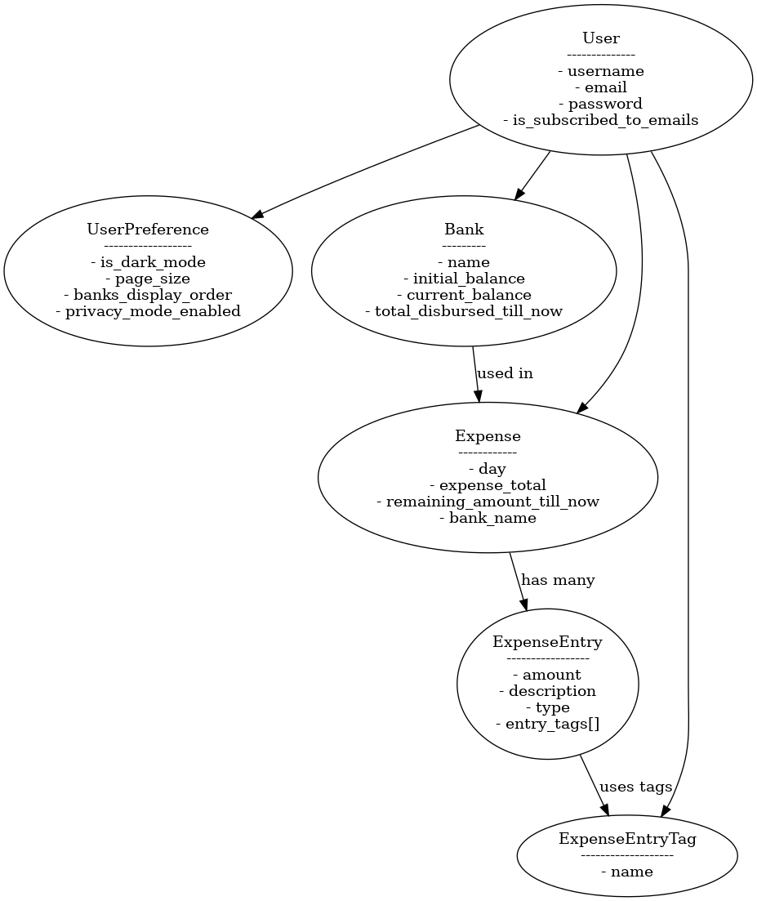

# 💰 Trace My Money

**Trace My Money** is a personal finance tracking application that helps users manage daily expenses, view insightful summaries, and maintain control over their financial activities — all in a secure and user-friendly environment.

---

## Features

### Bank Management
- Create and manage multiple bank accounts.
- Option to hide/show account balances for privacy.

### Secure Authentication
- Safe login and logout functionality.
- Session-based authentication for user security.

### Dark Mode & User Preferences
- Toggle between light and dark themes.
- Store user preferences such as:
  - Preferred theme (dark/light)
  - Show/hide account balances

### Advanced Filtering & Search
- Filter expenses by:
  - Date range
  - Bank accounts
  - Tags
  - Keywords
- Supports pagination for large datasets.

### Automated Email Reports
- Sends aggregated expense Excel reports to users.
- Supports daily, weekly, and monthly delivery.

---

## Tech Stack

- **Frontend:** Vue.js
- **Backend:** Flask (Python)
- **Database:** MongoDB
- **Authentication:** JWT / Session
- **Emailing:** SMTP-based email service (Mailgun)

---

## High Level Diagram

## Live Demo

[Check out the live app](https://myapp.trace-my-money.life/)  
